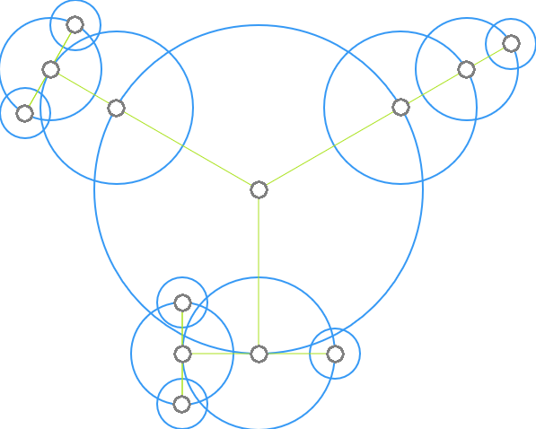

# Graph Essentials

This library provides 2-dimensional node distribution for (single or bi-directional) graphs on a coordinate system for visualization purposes.

It uses an orbital distribution layout, in which, starting with the heaviest node (highest weight when considering all children and their respective weights), each node places its children (lower weight neighbors) on a circular orbit around itself.



The orbit radius of a parent node is determined by the orbit size of the children placed on that parent's orbit.

The major advantage of this layout is that its algorithm is <u>not</u> force based; as a result, its computation does not require a time component.

## How to Use

Implement the interface _GraphNode_ and give a collection of your implementations to _**GraphEssentials**.distribute()_:

```java
int radius = 2;

List<MyNode> myNodes = Arrays.asList(
        new MyNode("A", radius, "B", "F", "I"),

        new MyNode("B", radius, "A", "C"),
        new MyNode("C", radius, "B"),

        new MyNode("D", radius, "A", "E", "F"),
        new MyNode("E", radius, "D"),
        new MyNode("F", radius, "D")
);

GraphEssentials.distribute(myNodes);
```

It will cause each _GraphNode_'s _setOrbit()_, _setX()_ and _setY()_ methods to be called once the calculation is over.

A simple implementation of _GraphNode_ could look like this:

```java
private static class MyNode implements GraphEssentials.GraphNode<String> {

        private final String id;
        private final double radius;
        private final Set<String> neighbors;
        private double orbit,x,y;

        private MyNode(String id, double radius, String... neighborIds) {
            this.id = id;
            this.radius = radius;
            this.neighbors = new HashSet<>(Arrays.asList(neighborIds));
        }

        @Override
        public String getIdentifier() {
            return this.id;
        }

        @Override
        public double getRadius() {
            return this.radius;
        }

        @Override
        public Set<String> getNeighbors() {
            return this.neighbors;
        }

        @Override
        public void setOrbit(double orbit) {
            this.orbit = orbit;
        }

        @Override
        public void setX(double x) {
            this.x = x;
        }

        @Override
        public void setY(double y) {
            this.y = y;
        }
    }
```